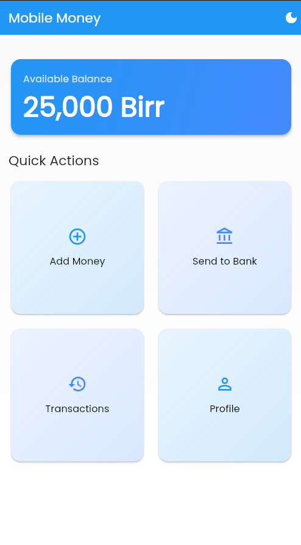
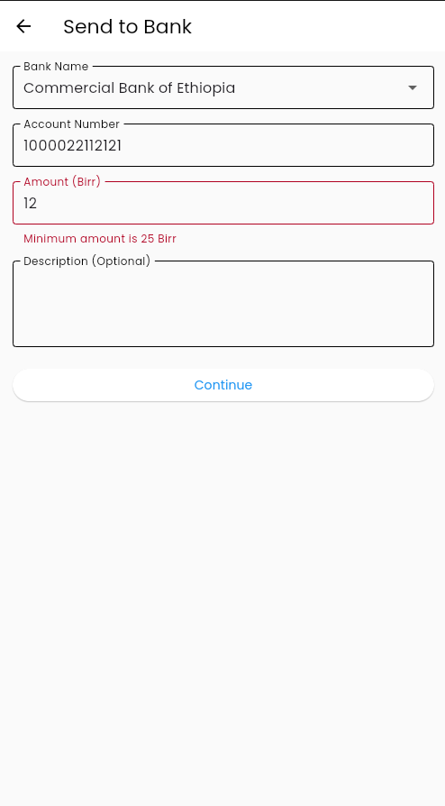
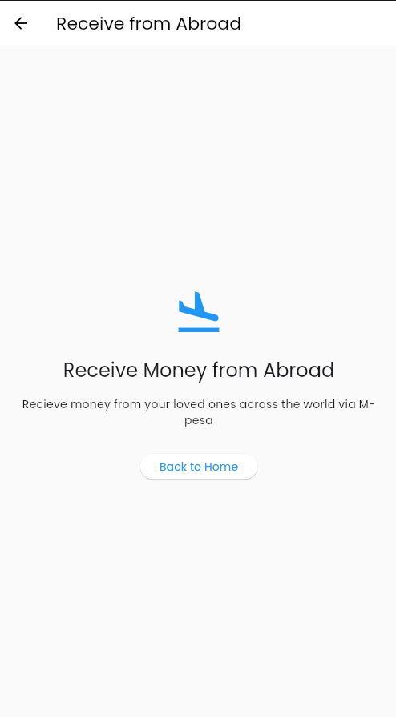
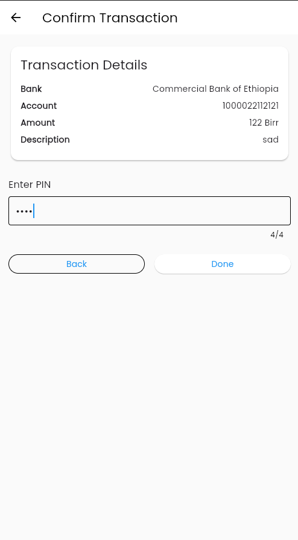
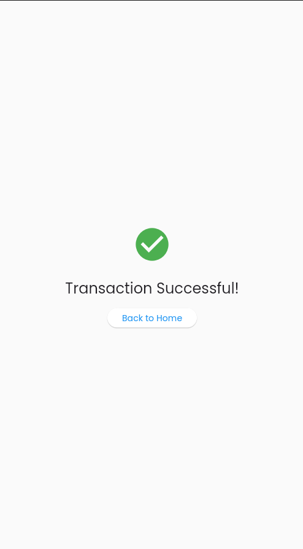
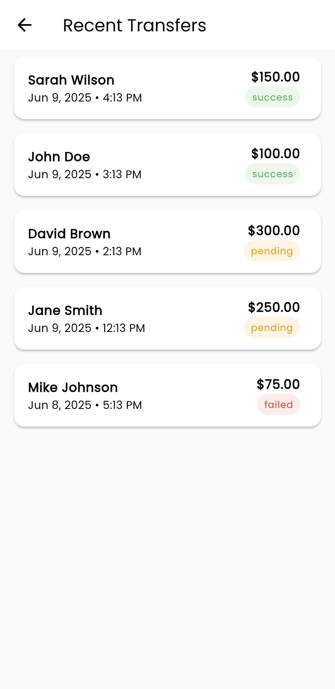
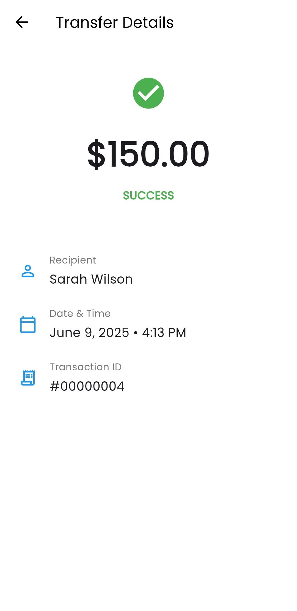

# mobilemoney

A mobile money app built using flutter.

## Getting Started

This app will be used to access your account easily using just you mobile and internet
here are some of the UI screenshots for light mode 
you can check the app for dark mode UI

## 📱 Screenshots

### Home Screen

### Add Money Screen

### send to bank Screen

### recieve money Screen

### confirmation Screen

### successfull Screen

### Transaction List Screen

### Transaction Detail Screen
